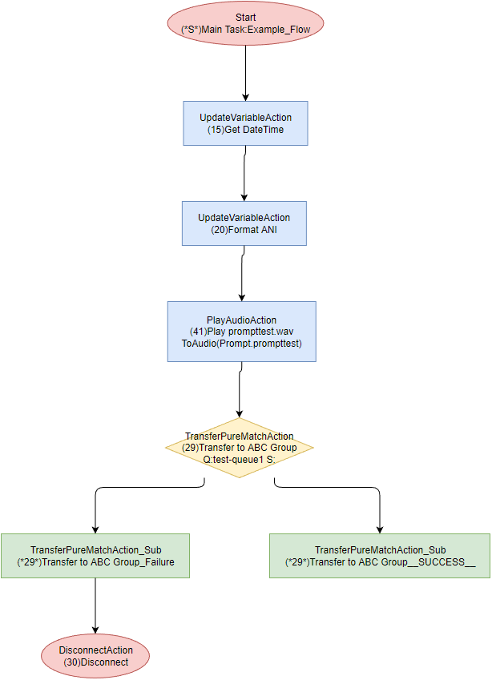

# CallFlowVisualizer

## 1. Overview

Create flowcharts of Genesys PureConnect or Genesys Cloud interaction flows with draw.io.

## 2. Creating Flowcharts

### 2.1 Import call flow data

#### From Genesys PureConnect

- Export XML file of Interaction Attendant data using DSEditU.exe.

#### From Genesys Cloud

- Specify organization name and fetch flows from Genesys Cloud. You can also use config.toml file for Genesys Cloud CLI to connect Genesys Cloud.

- There are 3 ways to create flowcharts:

  1.  Fetch all Architect flows from Genesys Cloud.
  2.  Specify a specific flowID and fetch from Genesys Cloud.
  3.  Specify JSON file of /api/v2/flows/{flowId} result.

### 2.2 Create CSV file for draw.io

Intermediate CSV files for draw.io will be created after the export/fetch completes.

### 2.3 Create flowcharts

draw.io will load intermediate CSV files and create flowcharts.

### 2.4 Edit flowcharts

There are 2 ways to edit flowcharts:

1. Open with draw.io (web/desktop app)
   If you need to amend contents in a flowchart, select shape, and press CTRL+M
2. Open with Visio

The draw.io.exe included in this app was customized for batch processing, so you can NOT use the "SAVE AS" functionality.
You should install official draw.io desktop app or use Visio.

## 3. Installation

1. Install, or validate installed, .NET 6.0 (required)
    https://aka.ms/dotnet-core-applaunch?framework=Microsoft.NETCore.App&framework_version=6.0.0&arch=x64&rid=win10-x64
2. Install draw.io desktop
    https://github.com/jgraph/drawio-desktop/releases/download/v20.7.4/draw.io-20.7.4-windows-installer.exe

3. Download the latest binary from [Releases](https://github.com/tishige/CallFlowVisualizer/releases) page
4. Create CallFlowVisualizer folder
5. Unzip CallFlowVisualizer.ZIP to CallFlowVisualizer folder
   Please note that for installation, do not unzip the CallFlowVisualizer.ZIP to a path containing spaces.
   The conversion to draw.io file format is currently not functioning correctly.

6. Create or Copy a ClientID and Client Secret of Client Credentials in Genesys Cloud. Required permission is Architect>Flow>View
7. Replace ClientID and Client Secret with your actual values in .\config.toml or specify the file path of existing config.toml in appsettings.json `"gcProfileFileName": "C:\\Users\\YourUserName\\.gc\\config.toml",`

## 4. How to use

### PureConnect

1. Run _x_:\I3\IC\Server\DSEDITU.exe (_x_ = PureConnect installed drive letter, typically D)
2. Select Root Entry->CustomerSite->Production->[ICSERVERNAME]->AttendantData
    Check value of **ActiveConfig**:
   - ActiveConfig = **Attendant**
      Select RootEntry->CustomerSite->Production->[ICSERVERNAME]->AttendantData->Attendant
   - ActiveConfig = **Attendant01**
      Select RootEntry->CustomerSite->Production->[ICSERVERNAME]->AttendantData->Attendant01
3. Select File -> Export
4. Save As XML file, e.g. PCSampleFlow.xml
5. Copy PCSampleFlow.xml to CallFlowVisualizer folder
6. Run `CallFlowVisualizer.exe PCSampleFlow.xml`
7. You should now see flowchart files each Attendant profile tree in .\flow folder

### Genesys Cloud

_Note: Replace sample values for org name, flowID and flow name with your actual values._

- Fetch all inbound call flows from a Genesys Cloud organization
   `CallFlowVisualizer.exe -f all -t inboundcall -p YourOrgName`
- Specify flowName in organization YourOrgName and save as png format
   `CallFlowVisualizer.exe -n MarketingDev -g -p YourOrgName`
- Specify flowID in organization YourOrgName and save as Visio format
   `CallFlowVisualizer.exe -f 31942f02-e8c6-46cc-8bed-63967548a8fa -v -p YourOrgName`
- Specify JSON file in c:\temp
   `CallFlowVisualizer.exe c:\temp\[YourOrgName](inqueuecall)_MarketingDiv_31942f02-e8c6-46cc-8bed-63967548a8fa.json`

#### Command Line argument

| Argument | Description                                                                             |
| -------- | --------------------------------------------------------------------------------------- |
| -d       | Create draw.io file                                                                     |
| -v       | Create draw.io, then convert to Visio format                                            |
| -g       | Create draw.io, then convert to png format                                              |
| -f       | Fetch latest flows from GenesysCloud                                                    |
| -a       | Load all JSON files in Architect folder                                                 |
| -p       | Organization name  If you omit this argument , [default] in config.toml will be used |
| -l       | Create Genesys Cloud Participant Data List as PDList_YYYYMMDD-hhmmss.csv                |
| -n       | Fetch latest flows with flowName from GenesysCloud                                      |
| -t       | Fetch latest flows with flowType from GenesysCloud                                      |

## 5. Customize file format and style

Change config values in appsettings.json

| Variables                  | Description                                                           | Default |
| -------------------------- | --------------------------------------------------------------------- | ------- |
| appendDateTimeToFileName   | Append dateTime value to fileName                                     | false   |
| appendGcFlowIdToFileName   | Append GenesysCloud flowId to fileName                                | false   |
| appendGcFlowTypeToFileName | Append GenesysCloud flowType to fileName e.g. InboundCall,InQueueCall | true    |
| appendGcOrgNameToFileName  | Append organization name to fileName                                  | true    |
| colorNode                  | Paint shapes                                                          | true    |
| nodeRound                  | Draw rounded shapes                                                   | false   |
| lineRound                  | Draw rounded lines                                                    | true    |
| convertToVisio             | Always convert to Visio format without specifying -v option           | false   |
| convertToPng               | Always convert to png format without specifying -n option             | true    |
| createParticipantDataList  | Always create Genesys Cloud Participant Data List                     | true    |
| createflowPerReusabletask  | Create draw.io flow files per Re-usable Task                          | false   |
| maxSecondDescriptionLengh  | Max second description length                                         | 1024    |
| showExpression             | Show expression for UpdateVariableAction / Get/SetAttributesAction    | true    |
| createPagePerReusabletask  | Create a separate page in draw.io for each Re-usable Task flow        | true    |

## 6. TIPS

1. To optimize created flowchart readability and impact, consider reviewing and updating Attendant and Archiect node names from default values.

2. It may take an hour or more to create flowcharts, if you have hundreds of flows.

3. While creating flowcharts, draw.io.exe repeatedly starts and stops. Please do not use your computer until flowchart creation completes.

4. You can convert to png or Visio format later with the following draw.io command line:

   - Convert default_profile.drawio to default_profile.png
      `.\draw.io -x -f png .\default_profile.drawio -o default_profile.png`

   - Convert default_profile.drawio to default_profile.vsdx
      `.\draw.io -x -f vsdx .\default_profile.drawio -o default_profile.vsdx`

   - Convert all .drawio files in c:\temp\flow to visio format, then save to c:\temp\visio
      `.\draw.io -x -f vsdx c:\temp\flow -o c:\temp\visio`
